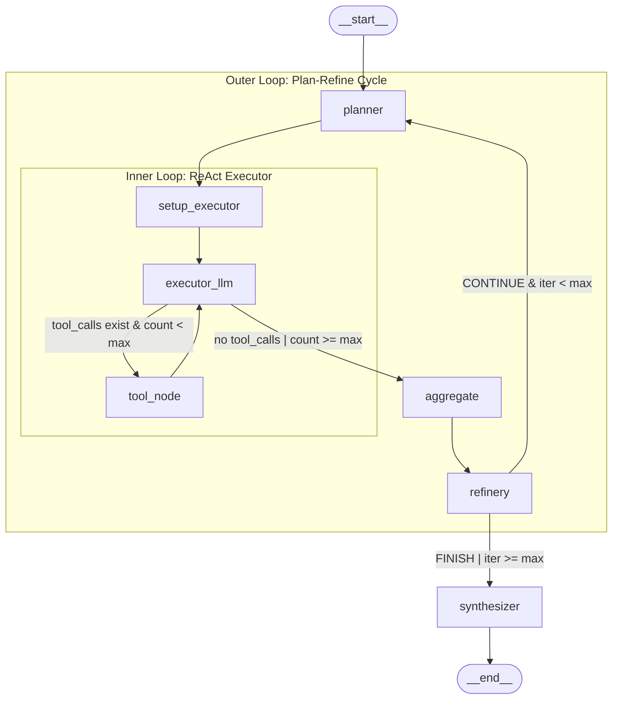

# Agent Architecture

## 1. Overview

The Code RAG Agent uses a **hybrid Plan + ReAct architecture** implemented with [LangGraph](https://langchain-ai.github.io/langgraph/). The design combines two established patterns:

- **Plan-and-Execute** (outer loop): A planner creates a step-by-step research plan, an executor runs each step, and a refinery decides whether to re-plan or finalize.
- **ReAct** (inner loop): Each plan step is executed by an LLM with tool access, iterating between reasoning (LLM calls) and acting (tool calls) until the task is complete.

This separation allows the agent to handle complex, multi-step code understanding queries while keeping each executor invocation focused and bounded.

**Key properties:**
- 7 nodes, 2 conditional edges, 10 state fields
- 3-layer safety against infinite loops (iteration cap, executor step cap, recursion limit)
- Message lifecycle management via `RemoveMessage` to control context window
- Singleton model and tool instances for resource efficiency

## 2. Graph Topology

The complete workflow is a directed graph with an outer planning loop and an inner ReAct executor loop:



**Edge summary:**

| From | To | Type | Condition |
|------|----|------|-----------|
| `__start__` | `planner` | entry | always |
| `planner` | `setup_executor` | linear | always |
| `setup_executor` | `executor_llm` | linear | always |
| `executor_llm` | `tool_node` | conditional | `route_executor` returns `"tools"` |
| `executor_llm` | `aggregate` | conditional | `route_executor` returns `"aggregate"` |
| `tool_node` | `executor_llm` | linear | always |
| `aggregate` | `refinery` | linear | always |
| `refinery` | `planner` | conditional | `should_continue` returns `"planner"` |
| `refinery` | `synthesizer` | conditional | `should_continue` returns `"synthesizer"` |
| `synthesizer` | `__end__` | terminal | always |

## 3. State Schema

Defined in `agent/state.py:8`. The `AgentState` is a `TypedDict` with 10 fields:

| Field | Type | Reducer | Description |
|-------|------|---------|-------------|
| `input` | `str` | overwrite | Original user query |
| `chat_history` | `List[BaseMessage]` | `add_messages` | Conversation history across turns |
| `plan` | `List[str]` | overwrite | Research steps from planner |
| `current_step` | `int` | overwrite | Index into `plan` |
| `findings` | `Dict[str, Any]` | overwrite | Evidence store keyed by step description |
| `response` | `str` | overwrite | Final synthesized answer |
| `loop_decision` | `Literal["CONTINUE","FINISH"]` | overwrite | Refinery decision |
| `messages` | `List[BaseMessage]` | `add_messages` | Executor ↔ ToolNode message buffer |
| `executor_call_count` | `int` | overwrite | LLM calls in current executor step |
| `iteration_count` | `int` | overwrite | Planner-executor-refinery cycles |

**`add_messages` reducer behavior:** Fields annotated with `Annotated[List[BaseMessage], add_messages]` use LangGraph's built-in message reducer. When a node returns a list of messages, they are **appended** to the existing list rather than overwriting it. The reducer also supports `RemoveMessage` — when a `RemoveMessage(id=...)` is in the returned list, the message with that ID is removed from the state. This is critical for the executor loop's message lifecycle management (see Section 8).

## 4. Node-by-Node Detail

### 4.1 `planner` — Plan Generation

- **Code:** `agent/nodes.py:37` (`plan_node`)
- **Reads:** `input`, `findings`, `iteration_count`
- **Writes:** `plan`, `current_step` (reset to 0), `iteration_count` (incremented)
- **LLM chain:** `PLAN_PROMPT | get_model() | JsonOutputParser()`
- **Error handling:** If the chain raises any exception or returns a non-list, falls back to `["Search for relevant code related to the query"]`

The planner examines the user query and any existing findings to generate a list of actionable research steps. On re-planning (iteration > 0), it creates steps targeting only the **missing** information.

### 4.2 `setup_executor` — Executor Initialization

- **Code:** `agent/nodes.py:66` (`setup_executor`)
- **Reads:** `current_step`, `plan`, `findings`, `messages`
- **Writes:** `messages` (RemoveMessage + SystemMessage + HumanMessage), `executor_call_count` (reset to 0)
- **LLM chain:** None (pure state transformation)
- **Error handling:** Gracefully handles empty plan with "No more steps to execute"

This node prepares the executor's message buffer for a new plan step:
1. Emits `RemoveMessage` for every existing message (clearing the previous step)
2. Creates a `SystemMessage` with the current task context and prior findings
3. Creates a `HumanMessage` with the specific step instruction

### 4.3 `executor_llm` — ReAct LLM Call

- **Code:** `agent/nodes.py:104` (`executor_llm_node`)
- **Reads:** `messages`, `executor_call_count`
- **Writes:** `messages` (appends AIMessage), `executor_call_count` (incremented)
- **LLM chain:** `get_model_with_tools().invoke(messages)` (direct invocation, not a chain)
- **Error handling:** Exceptions propagate to the graph runner

Invokes the LLM with all 5 tools bound. The response `AIMessage` may contain `tool_calls` (triggering the inner loop via `tool_node`) or plain content (proceeding to `aggregate`).

### 4.4 `tool_node` — Tool Execution

- **Code:** `agent/graph.py:65` (LangGraph's `ToolNode(get_tools(), handle_tool_errors=True)`)
- **Reads:** `messages` (last AIMessage's `tool_calls`)
- **Writes:** `messages` (appends ToolMessage for each tool call result)
- **LLM chain:** None (LangGraph built-in)
- **Error handling:** `handle_tool_errors=True` catches tool exceptions and returns error content as a ToolMessage instead of crashing the graph

This is a LangGraph prebuilt node. It inspects the last `AIMessage` for `tool_calls`, dispatches each call to the corresponding `@tool` function, and returns the results as `ToolMessage` entries.

### 4.5 `aggregate` — Findings Collection

- **Code:** `agent/nodes.py:144` (`aggregate_node`)
- **Reads:** `messages`, `current_step`, `plan`, `findings`
- **Writes:** `findings` (new entry added), `current_step` (incremented), `messages` (RemoveMessage for all)
- **LLM chain:** None (pure state transformation)
- **Error handling:** Returns "No results found" if no tool/AI content is found

Collects content from the executor loop:
- `ToolMessage` content (tool results)
- `AIMessage` content without `tool_calls` (LLM summaries)

Joins them with `\n---\n` separators and stores under key `f"step_{idx}: {step_description}"`. Then clears all messages and advances `current_step`.

### 4.6 `refinery` — Decision Gate

- **Code:** `agent/nodes.py:181` (`refine_node`)
- **Reads:** `input`, `findings`, `plan`, `current_step`, `iteration_count`
- **Writes:** `loop_decision`
- **LLM chain:** `REFINE_PROMPT | get_model() | JsonOutputParser()`
- **Error handling:** On chain failure, defaults to `CONTINUE` if `current_step < len(plan)`, else `FINISH`. Forced `FINISH` if `iteration_count >= max_iterations`.

Evaluates whether gathered findings are sufficient to answer the user's query. Returns a JSON object with `decision` and `reason`. The `should_continue` edge function (see Section 5) then routes based on this decision.

### 4.7 `synthesizer` — Final Answer

- **Code:** `agent/nodes.py:214` (`synthesize_node`)
- **Reads:** `input`, `findings`
- **Writes:** `response`
- **LLM chain:** `SYNTHESIZE_PROMPT | get_model() | StrOutputParser()`
- **Error handling:** Exceptions propagate to the graph runner

Combines all accumulated findings into a comprehensive answer using markdown formatting. This is always the final node before `__end__`.

## 5. Conditional Routing

### 5.1 `route_executor` — Inner Loop Routing

**Code:** `agent/nodes.py:123`

Called after `executor_llm`. Returns one of two string labels:

```
"tools"     → route to tool_node    (inner loop continues)
"aggregate" → route to aggregate    (inner loop exits)
```

**Decision logic:**
1. If `messages` is empty → `"aggregate"`
2. If last message is an `AIMessage` with `tool_calls` AND `executor_call_count < config.max_executor_steps` → `"tools"`
3. Otherwise → `"aggregate"` (including when max steps reached)

### 5.2 `should_continue` — Outer Loop Routing

**Code:** `agent/graph.py:22`

Called after `refinery`. Returns one of two string labels:

```
"planner"     → route to planner      (outer loop continues)
"synthesizer" → route to synthesizer   (outer loop exits)
```

**Decision logic:**
1. If `iteration_count >= config.max_iterations` → `"synthesizer"` (forced exit)
2. If `loop_decision == "CONTINUE"` → `"planner"`
3. Otherwise → `"synthesizer"`

## 6. Tool Binding Mechanism

The tool system follows a layered architecture:

```
@tool decorator     →  get_tools()  →  bind_tools()  →  ToolNode()
(agent/tools.py)       returns          model.py:50      graph.py:65
                       List[BaseTool]
```

### Flow:
1. **Definition:** 5 functions decorated with `@tool` in `agent/tools.py:50-78`. Each delegates to a singleton tool class instance.
2. **Collection:** `get_tools()` (`agent/tools.py:84`) returns all 5 as `List[BaseTool]`.
3. **Binding:** `get_model_with_tools()` (`agent/model.py:42`) calls `get_model().bind_tools(get_tools())`, creating a model that knows about tool schemas and can emit `tool_calls` in its response.
4. **Execution:** `ToolNode(get_tools())` (`agent/graph.py:65`) creates a LangGraph prebuilt node that dispatches `tool_calls` from the AIMessage to the actual `@tool` functions.

### Registered Tools:

| Tool | Description | Delegates to |
|------|-------------|-------------|
| `search_codebase(query, n_results)` | Hybrid semantic + keyword search | `SearchTool.search_codebase()` |
| `read_file(file_path)` | Read file contents | `FileSystemTools.read_file()` |
| `list_directory(path)` | List directory entries | `FileSystemTools.list_dir()` |
| `get_callers(function_name)` | Find callers via call graph | `RelatedCodeTool.get_callers()` |
| `get_callees(function_name)` | Find callees via call graph | `RelatedCodeTool.get_callees()` |

### Singleton Management

Tool class instances (`SearchTool`, `FileSystemTools`, `RelatedCodeTool`) are cached in a module-level `_instances` dict (`agent/tools.py:21`). This ensures:
- Expensive resources (ChromaDB connections, BM25 indices, NetworkX graphs) are created once
- `reset_tools()` clears all cached instances (useful for testing)

## 7. Prompt Architecture

All prompt templates are centralized in `agent/prompts.py` as `ChatPromptTemplate` instances.

### 7.1 `PLAN_PROMPT` (line 25)
- **Role:** Expert software architect / planner
- **System message:** Guidelines for incremental planning, granularity, JSON output
- **Variables:** `{input}` (user query), `{findings}` (formatted existing evidence)
- **Output format:** JSON array of strings parsed by `JsonOutputParser`

### 7.2 `EXECUTOR_SYSTEM` / `EXECUTOR_USER` (lines 32, 46)
- **Role:** Code research assistant
- **System message:** Current task context with step description and prior findings
- **Variables:** `{current_step}` (step description), `{findings}` (prior evidence)
- **Note:** Not a ChatPromptTemplate — raw strings formatted in `setup_executor` and used as `SystemMessage`/`HumanMessage` directly

### 7.3 `REFINE_PROMPT` (line 63)
- **Role:** Project manager overseeing code research
- **System message:** Evaluation criteria (code snippets, structure, concepts)
- **Variables:** `{input}`, `{findings}`, `{step}` (completed steps), `{total}` (total steps)
- **Output format:** JSON object `{"decision": "CONTINUE"|"FINISH", "reason": "..."}` parsed by `JsonOutputParser`

### 7.4 `SYNTHESIZE_PROMPT` (line 82)
- **Role:** Expert software engineer
- **System message:** Guidelines for referencing code, structuring with sections, markdown formatting
- **Variables:** `{input}`, `{findings}` (full findings with headers)
- **Output format:** Free-form markdown string parsed by `StrOutputParser`

## 8. Message Lifecycle

The `messages` state field is used exclusively for the executor inner loop (`executor_llm ↔ tool_node`). Its lifecycle within a single plan step:

```
setup_executor:
  1. Emit RemoveMessage(id=...) for every existing message  ← clears previous step
  2. Append SystemMessage (task context)
  3. Append HumanMessage (step instruction)

executor_llm (iteration 1):
  4. Append AIMessage (may contain tool_calls)

tool_node (if tool_calls):
  5. Append ToolMessage for each tool call result

executor_llm (iteration 2):
  6. Append AIMessage (may have more tool_calls or final summary)
  ... (repeat until route_executor returns "aggregate")

aggregate:
  7. Read all ToolMessage + final AIMessage content → store in findings
  8. Emit RemoveMessage(id=...) for every message  ← clears for next step
```

This pattern prevents message accumulation across steps, keeping the executor's context window focused on the current task.

## 9. Safety Mechanisms

Three layers protect against infinite loops and runaway costs:

### Layer 1: `max_iterations` (outer loop)
- **Config:** `config.max_iterations` (default: 10, env: `MAX_ITERATIONS`)
- **Enforced in:** `refine_node` (line 187) — forces `FINISH` before LLM call
- **Enforced in:** `should_continue` (line 33) — routes to `synthesizer` regardless of decision
- **Scope:** Limits the number of planner → executor → refinery cycles

### Layer 2: `max_executor_steps` (inner loop)
- **Config:** `config.max_executor_steps` (default: 5, env: `MAX_EXECUTOR_STEPS`)
- **Enforced in:** `route_executor` (line 135) — routes to `aggregate` when count reaches limit
- **Scope:** Limits how many tool-calling rounds the executor can perform per plan step

### Layer 3: `recursion_limit` (graph-level)
- **Config:** Passed to `app.invoke()` as `config={"recursion_limit": 150}` (`agent/core.py:44`)
- **Enforced by:** LangGraph runtime
- **Scope:** Hard cap on total node invocations across the entire graph execution

## 10. Singletons and Reset

### Model Singletons (`agent/model.py`)

| Function | Returns | Scope |
|----------|---------|-------|
| `get_model()` | Base LLM (Gemini or Ollama) | Used by planner, refinery, synthesizer |
| `get_model_with_tools()` | Base LLM + `bind_tools(get_tools())` | Used by executor_llm |
| `reset_model()` | Clears both singletons | For testing / config changes |

### Tool Singletons (`agent/tools.py`)

| Function | Returns | Scope |
|----------|---------|-------|
| `get_tools()` | `List[BaseTool]` (5 tools) | For bind_tools() and ToolNode() |
| `reset_tools()` | Clears `_instances` dict | For testing / project_root changes |

Private singleton factories: `_get_search_tool()`, `_get_fs_tool()`, `_get_related_tool()`.

## 11. Directory Structure

```
src/agent/
├── __init__.py      # Package init
├── core.py          # CodeAgent class — entry point wrapper (line 13)
├── graph.py         # StateGraph definition, should_continue, define_graph (line 45)
├── nodes.py         # 7 node functions + _format_findings helper
├── state.py         # AgentState TypedDict with 10 fields
├── model.py         # LLM singleton factory (Gemini / Ollama)
├── prompts.py       # 4 prompt templates (plan, executor, refine, synthesize)
└── tools.py         # 5 @tool definitions + get_tools() + reset_tools()
```

### Supporting modules:

```
src/tools/
├── search_tool.py   # SearchTool — wraps hybrid SearchEngine
├── structure.py     # FileSystemTools — read_file, list_dir with path validation
└── related.py       # RelatedCodeTool — get_callers, get_callees via GraphStore
```

## 12. Visualization and Monitoring

### Graph Visualization

```bash
# Print Mermaid diagram to stdout (no API keys needed)
python scripts/visualize_graph.py --mermaid

# Save as PNG (requires external Mermaid rendering API)
python scripts/visualize_graph.py --png graph.png

# ASCII art in terminal (requires grandalf package)
python scripts/visualize_graph.py --ascii
```

### Execution Monitoring

```bash
# Watch agent execution in real-time (requires API keys)
python scripts/monitor_agent.py "How does the search engine work?"

# Verbose mode — full state dumps at each node
python scripts/monitor_agent.py "How does the search engine work?" --verbose
```

See `scripts/visualize_graph.py` and `scripts/monitor_agent.py` for implementation details.
