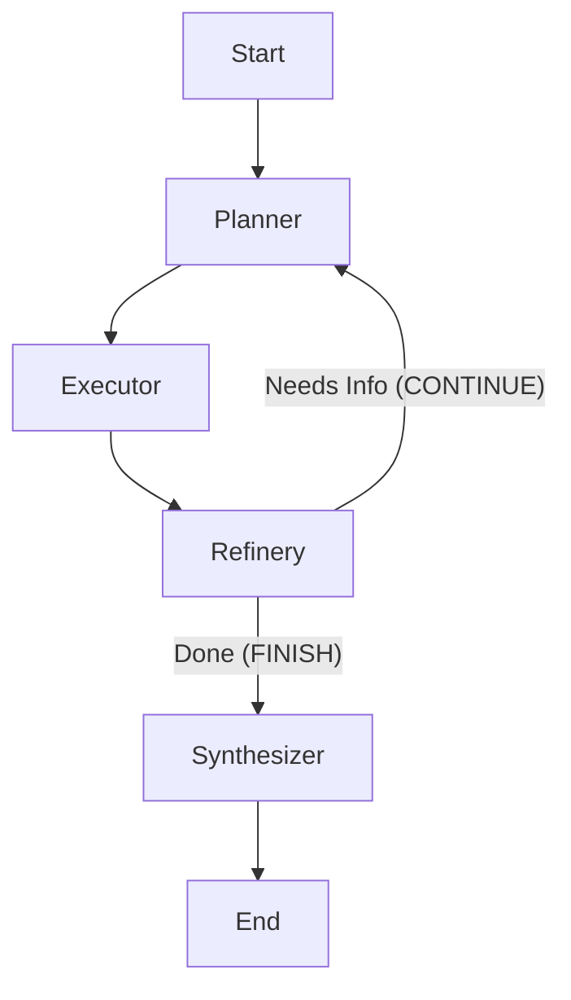

# Agent Architecture

## Overview
The `code-rag-agent` uses a **stateful, graph-based architecture** implemented with [LangGraph](https://langchain-ai.github.io/langgraph/). This design allows the agent to break down complex queries into steps, maintain context across actions, and refine its answers based on gathered evidence.

## Core Concepts

### 1. State Machine
Unlike a simple request/response model, this agent operates as a state machine. It maintains a persistent `AgentState` throughout the lifecycle of a query.

**State Schema (`src/agent/state.py`)**:
- **`input`**: The original user query.
- **`plan`**: A list of research steps (e.g., "Find class X", "Check usage of Y").
- **`current_step`**: Pointer to the current active step in the plan.
- **`findings`**: A dictionary acting as "long-term memory" for the session, storing results from tools.
- **`chat_history`**: Record of the conversation.

### 2. The Graph (`src/agent/graph.py`)
The workflow is defined as a directed graph with a **Dynamic Replanning Loop**:



### 3. Nodes (`src/agent/nodes.py`)

#### **Planner Node**
- **Input**: User query + (Optional) Existing Findings.
- **Action**: 
    - Analyzes the request and current progress.
    - Generates a plan for the *next* logical steps.
    - If findings are present, it adapts the plan (Dynamic Replanning).
- **Output**: Populates `state['plan']`.

#### **Executor Node**
- **Input**: Current plan step.
- **Action**: 
    - Executes the top step from the plan.
    - Uses tools (`SearchTool`, `FileSystemTools`, etc.).
    - Updates `state['findings']`.
- **Output**: Increments `current_step`.

#### **Refinery Node**
- **Input**: User query + Accumulated Findings.
- **Action**: 
    - Evaluates if the gathered info is sufficient to answer the user.
    - Decides whether to **model** a new plan (Loop to Planner) or **finalize** (Move to Synthesizer).
- **Output**: Sets `state['loop_decision']` to `CONTINUE` or `FINISH`.

#### **Synthesizer Node**
- **Input**: Original query & all gathered findings.
- **Action**: Generates a final, comprehensive answer.
- **Output**: Populates `state['response']`.

## Extensibility
This architecture is designed for growth:
- **New Tools**: Can be added to the `Executor` node without changing the flow.
- **Smarter Planning**: The `Planner` can be enhanced to use "Chain of Thought" or hierarchical planning.
- **Human-in-the-loop**: LangGraph supports breakpoints, allowing a user to approve a plan before execution (future feature).

## Directory Structure
```
src/agent/
├── core.py         # Entry point (CodeAgent wrapper)
├── graph.py        # Graph definition (StateGraph wiring)
├── nodes.py        # Logic for individual nodes (Plan, Execute, Synthesize)
└── state.py        # TypedDict definition of AgentState
```
